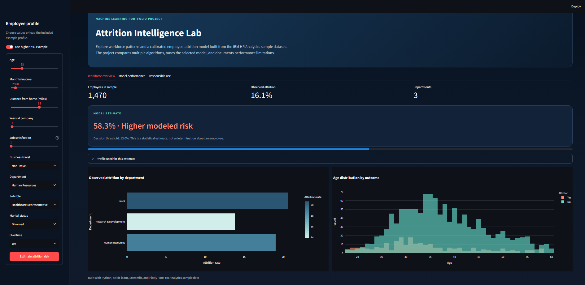
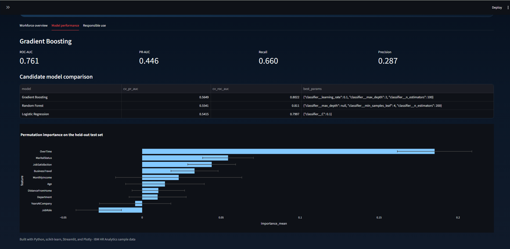
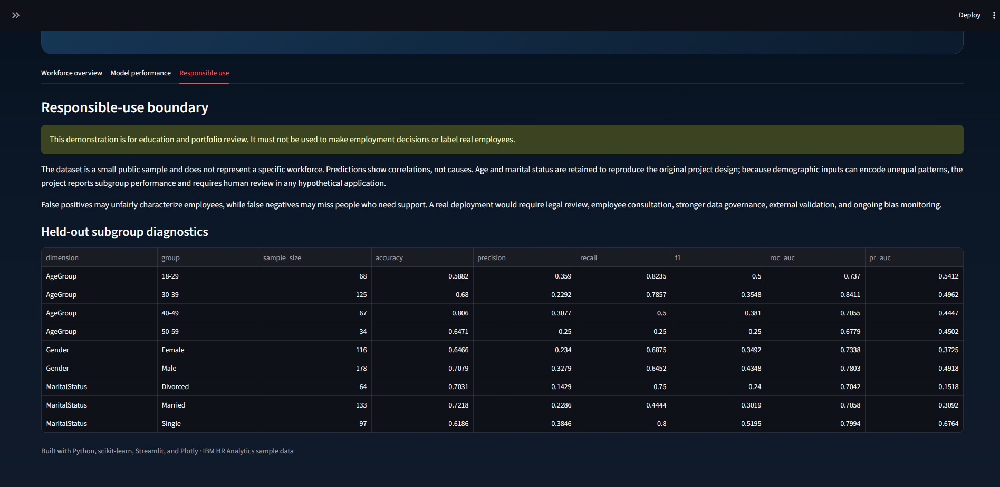

# Attrition Intelligence Lab

An end-to-end machine-learning portfolio project that explores employee attrition with the IBM HR Analytics sample dataset. It combines reproducible model selection, probability calibration, threshold tuning, subgroup diagnostics, and an interactive Streamlit dashboard.

## Application preview

### Interactive risk and workforce overview



### Model comparison and feature importance



### Responsible-use and subgroup diagnostics



> **Responsible-use notice:** This is an educational demonstration, not an employment decision system. Its outputs must not be used to evaluate, rank, retain, or dismiss real employees.

## What this project demonstrates

- A leakage-safe scikit-learn preprocessing and modeling pipeline
- Comparison of logistic regression, random forest, and gradient boosting
- Five-fold stratified hyperparameter search using PR-AUC and ROC-AUC
- Calibrated probability estimates and an F2-optimized decision threshold
- Held-out precision, recall, F1, ROC-AUC, PR-AUC, and confusion matrix
- Permutation importance and demographic subgroup diagnostics
- A polished Streamlit interface with interactive Plotly visualizations
- Automated tests, lint configuration, and GitHub Actions CI

## Architecture

```text
Raw CSV → validation → train/test split → preprocessing → model search
        → calibration → threshold selection → held-out evaluation
        → model + reports → Streamlit dashboard
```

## Repository structure

```text
├── app.py                         # Streamlit application
├── train_model.py                 # Convenient training entry point
├── src/                           # Data, modeling, training, and configuration
├── tests/                         # Fast unit tests
├── data/                          # IBM HR Analytics sample CSV
├── models/                        # Generated deployable model artifact
├── reports/                       # Generated metrics, tables, and figures
├── docs/
│   ├── MODEL_CARD.md               # Intended use, limitations, and risks
│   └── images/                     # Current application screenshots
├── requirements.txt
├── pyproject.toml
└── .github/workflows/ci.yml
```

## Quick start

Python 3.11 or 3.12 is recommended.

```bash
python -m venv .venv
```

Activate the environment:

```bash
# Windows PowerShell
.venv\Scripts\Activate.ps1

# macOS or Linux
source .venv/bin/activate
```

Install, train, and launch:

```bash
python -m pip install --upgrade pip
python -m pip install -r requirements.txt
python train_model.py
streamlit run app.py
```

Training writes the selected model to `models/` and evaluation artifacts to `reports/`. All paths are resolved relative to the repository, so commands work from any current directory.

## Evaluation design

The data is divided into a stratified 80% training set and a 20% untouched test set. Candidate models and hyperparameters are compared only within the training set using five-fold cross-validation. The winning pipeline is probability-calibrated. Its decision threshold is selected from out-of-fold training predictions by maximizing F2, which gives recall more weight than precision.

Run training to regenerate the exact metrics. Machine-readable results are saved in `reports/metrics.json`, `model_comparison.csv`, `feature_importance.csv`, `subgroup_metrics.csv`, and `reports/figures/`.

Accuracy is not used as the selection metric because attrition is the minority outcome. PR-AUC is the primary selection metric.

### Current reproducible result

The latest seeded run selected **Gradient Boosting**. On the untouched 294-row test set:

| Metric | Score |
| --- | ---: |
| ROC-AUC | 0.761 |
| PR-AUC | 0.446 |
| Recall | 0.660 |
| Precision | 0.287 |
| F1 | 0.400 |
| Accuracy | 0.684 |

The F2-optimized threshold was `0.13`. The low precision is an important limitation: many profiles flagged by this demonstration are false positives. These results should be read as evidence of the workflow, not evidence that the model is suitable for employment use.

## Testing and code quality

```bash
pytest
ruff check .
```

GitHub Actions runs both checks on every push and pull request.

## Features and demographics

The model retains the ten inputs used in the original project: age, monthly income, distance from home, years at the company, job satisfaction, business travel, department, job role, marital status, and overtime.

Age and marital status can encode sensitive patterns. They are retained here to document the original experiment, not to endorse their use in employment decisions. The generated subgroup report slices held-out performance by age group, gender, and marital status. These diagnostics reveal differences but do not establish fairness or causality. See the [model card](docs/MODEL_CARD.md) for the full boundary.

## Dataset

The repository uses the IBM HR Analytics Employee Attrition & Performance sample dataset: 1,470 rows and 35 source columns. It is commonly used for learning and demonstrations; it is not representative of a real organization and should not be treated as production evidence.

If distributing or deploying a fork, independently confirm the dataset's source terms and attribution requirements.

## Deployment

The app can be deployed on Streamlit Community Cloud or another Python host. Train and commit a compatible model artifact first, configure the host to run `streamlit run app.py`, and use the same dependency constraints as `requirements.txt`.

## License

Project code is available under the [MIT License](LICENSE). The dataset may be subject to separate source terms.

## Author

Created by Jesse McClure as a machine-learning and data-application portfolio project.
